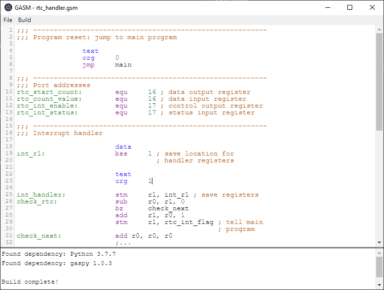

gumnut-assembler-editor
#######################

Editor for gumnut-assembler (Gumnut Assembler written in Python) using *Electron*.

  

Requirements
============

As of now *gumnut-assembler-editor* is only available as this repo. There are no pre-build executables. This means
you'll need to install the following dependencies/tools:

* Node.js (https://nodejs.org/de/download/)
* electron (https://www.electronjs.org/docs/tutorial/installation)
* yarn (https://yarnpkg.com/getting-started/install)
* Python 3.x.x (https://www.python.org/downloads/)
* gumnut-assembler (https://gumnut-assembler.readthedocs.io/en/latest/)

Quick-Start
===========

1. Download or clone this repo
2. Open your command line and navigate into the repo
3. Run ``yarn``. It will install some packages which are needed (see ``package.json``)
4. Run ``yarn start``. It will (hopefully) run *gumnut-assembler-editor

Documentation
=============

Proper documentation will follow for sure...
